## 一、第一个包分析

**打开pcap，看整体概览**
导入后做协议的分级统计
```plain
协议分布：
- TCP: 98.7%  （预计占大部分）
- HTTP: 0.3% （初始下载）
- TLS/SSL: 14.7% （C2通信）
- SMB: 1.1%  （横向移动）
- DNS: 1.1%  （域名解析）
- 其他: __%
```
异常指标：
- [x]  HTTP占比是否异常高？（正常<5%，恶意可能>10%）
- [ ]  是否有大量TLS流量？（Qakbot C2特征）
- [x] 是否有SMB流量？（内网横向）

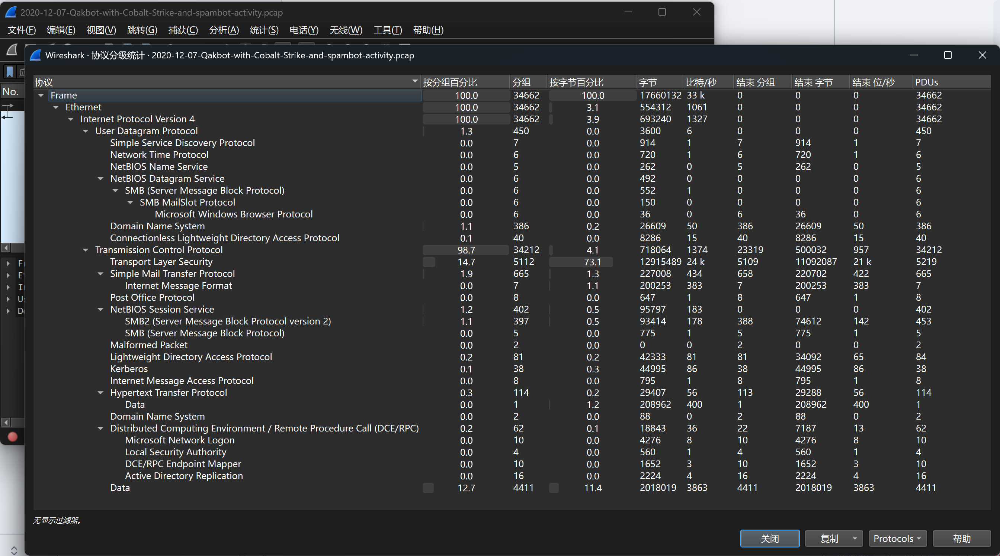

**找受害者IP**

统计-端点-IPv4
按照分组（包数）排序，“**分组**”列是 **收发分组的总数** （Tx+Rx）
```plain
排名1: IP 10.12.7.101   包数: 34662  字节: 18MB  （可能是受害者或C2）
排名2: IP 104.127.9.67  包数: 14513  字节: 11MB
排名3: IP 53.36.108.120 包数: 6990   字节: 2MB
```
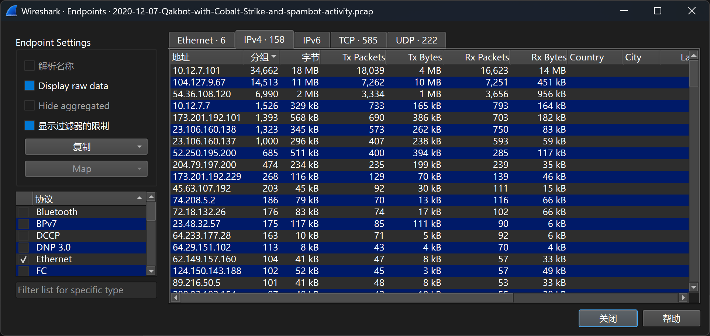
- 识别受害者：
   IP：10.12.7.101   MAC：
统计--捕获文件属性，查看包的时间
```
第一个时间：2020-12-08 04:48:52
最后一个时间；2020-12-08 05:58:30
```
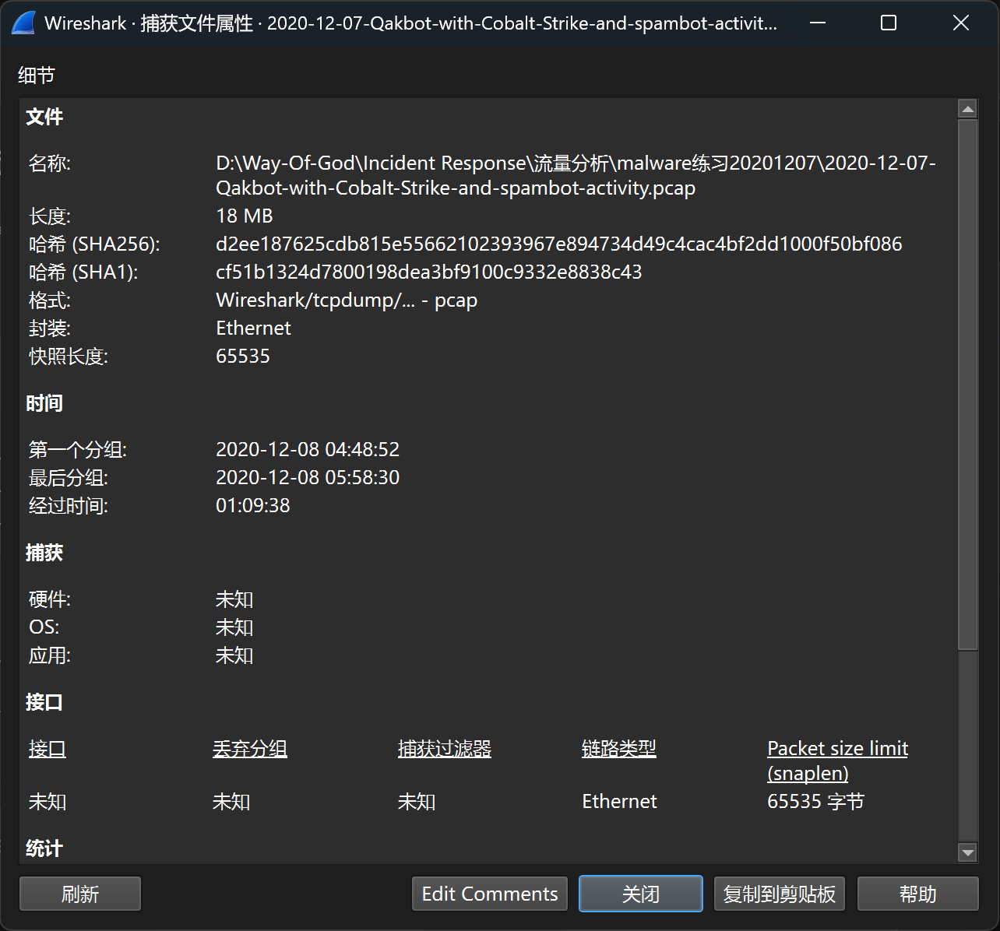

**查看邮件情况**
筛选smtp.data.fragment
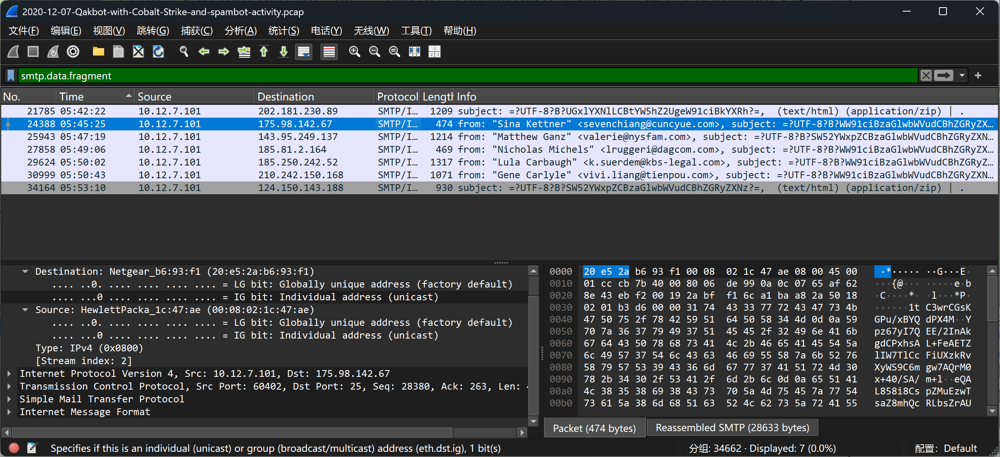


导出imf到本地查看

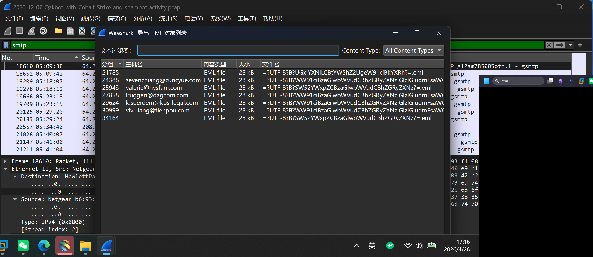
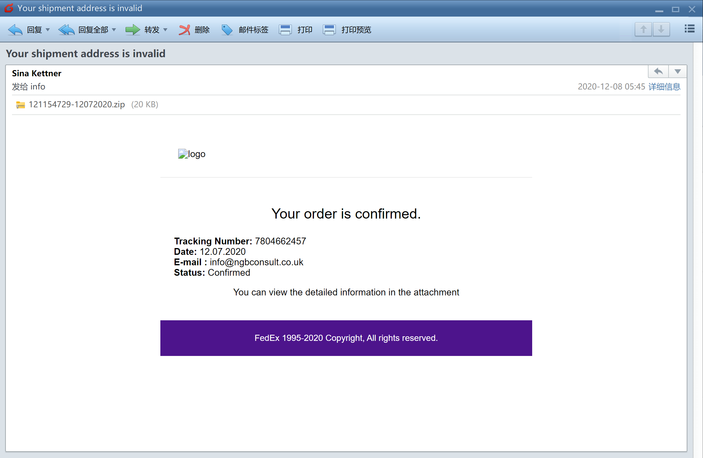
携带有恶意的附件，下载附件进行分析（本地会报毒)，研究宏病毒，如何请求恶意文件下载，然后通过恶意文件进行链接C2服务器
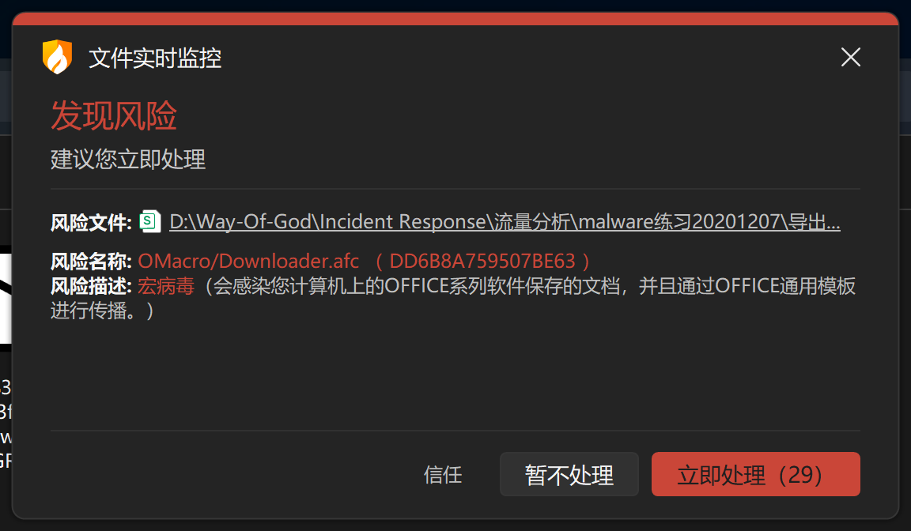
丢沙箱运行一下，不做本地打开分析了
行为就是利用 `rundll32` 执行 从远程 URL 下载 payload 到 AppData 目录
- url：http://www.pharmainstruelec.com/nezlzltik/590906.jpg
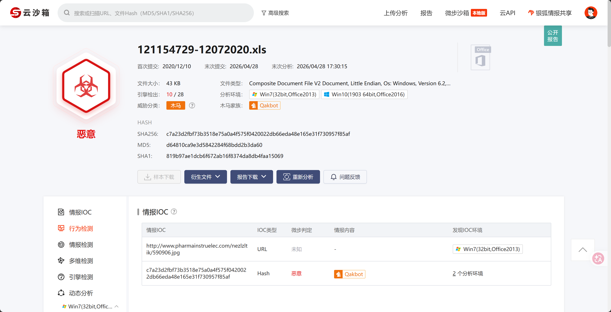


**定位HTTP初始下载**
导入start-of-new查看最开始是怎么感染qakbot的
筛选http.request
Qakbot的特征：
- 初始载体：Excel表格（含宏）
- 宏下载URL：通常以 `.jpg` 结尾，但实际返回DLL

```
时间: 08:17:25
源IP: 10.12.8.101 （受害者）
目的IP: 35.214.136.217 （被入侵网站）
URL: http://raformatico.com/mjbgpabrmph/590906.jpg
User-Agent: Mozilla/4.0 (compatible; MSIE 7.0; Windows NT 10.0; WOW64; Trident/7.0; .NET4.0C; .NET4.0E)
Host头: raformatico.com
content-type：application/octet-stream

可疑点：
□ URL以.jpg结尾但实际下载二进制？（Qakbot特征）
□ Host是否为被入侵的合法网站？（WordPress等）
□ User-Agent是否为正常浏览器？
```
ua头分析：
- 宣称 `MSIE 7.0`，但 `Trident/7.0` 实际上是 **IE11 的内核版本**（矛盾且过时）。
- `Windows NT 10.0` 对应 Windows 10 / 11，却用 IE7 模式？极不寻常。
- 包含 `.NET` 信息，常见于自动化工具或恶意软件自定义 UA
文件请求分析：
- **文件扩展名**：`.jpg`（图片）
- **实际内容**：从内容看是二进制可执行文件
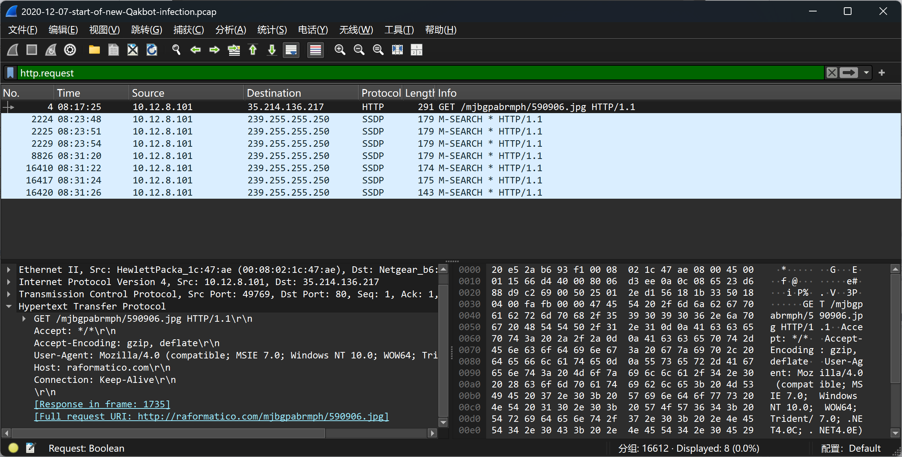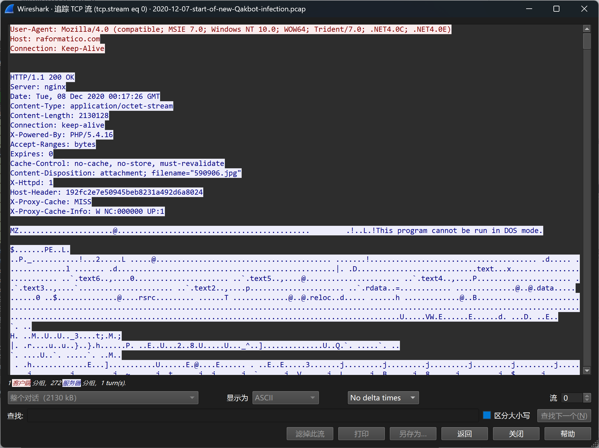
**导出恶意文件**

导出本地直接报毒
```plain
文件名: 590906.jpg
文件类型: JPG 图片文件 (.jpg)
MD5: 9939609ff3ebe8b8687e7cf74b5d033f
```

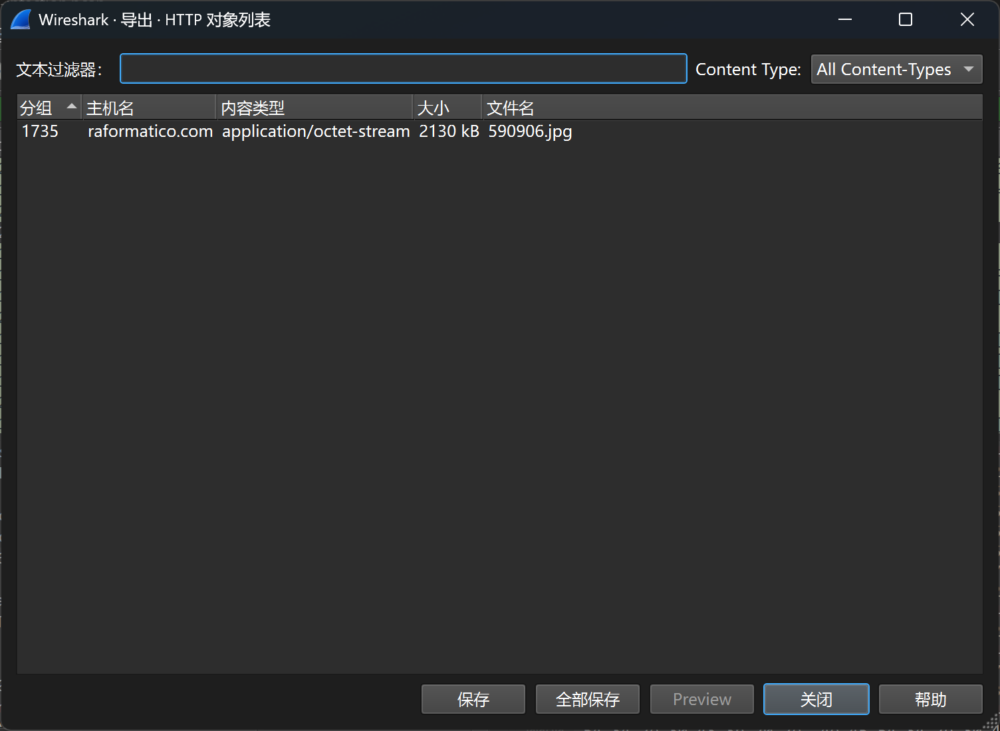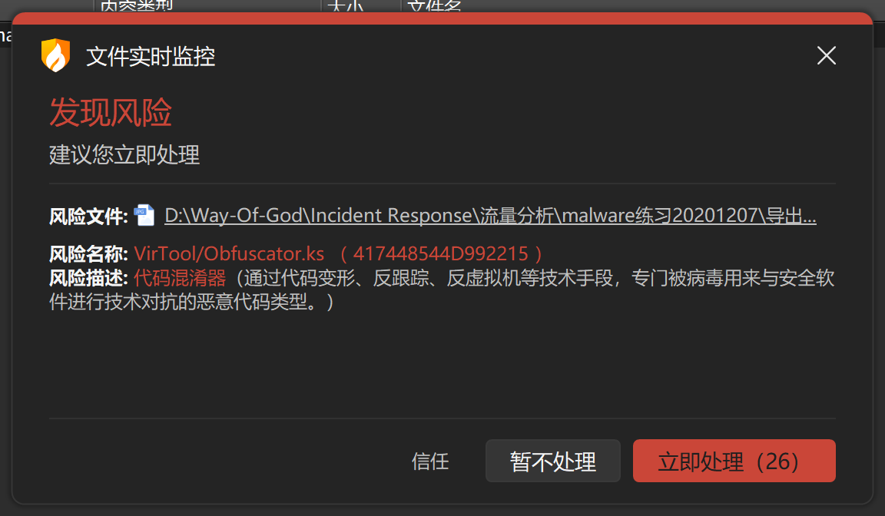